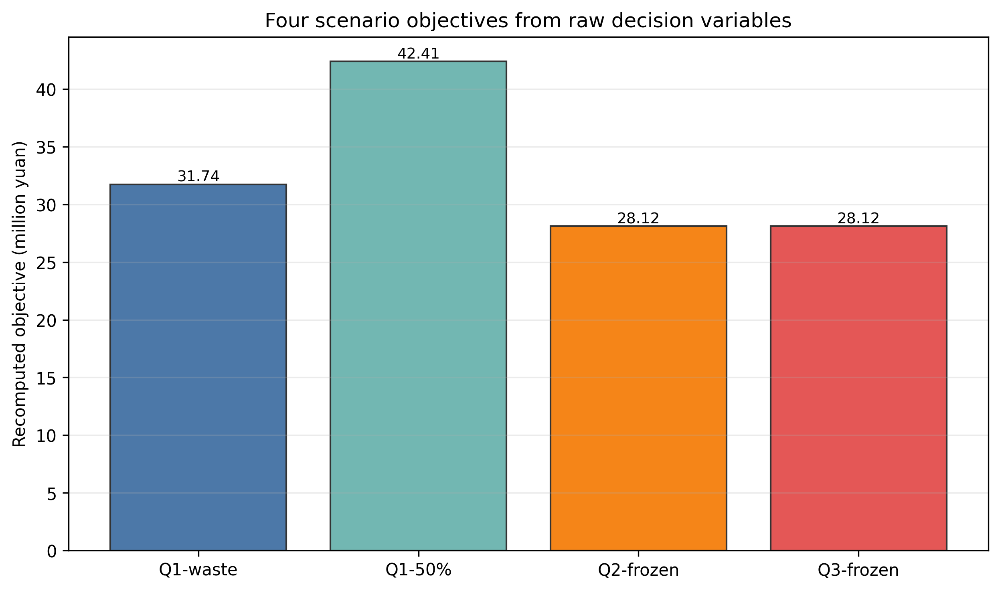
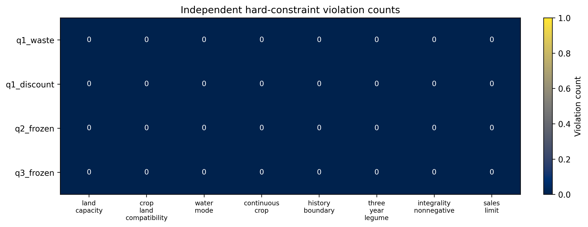
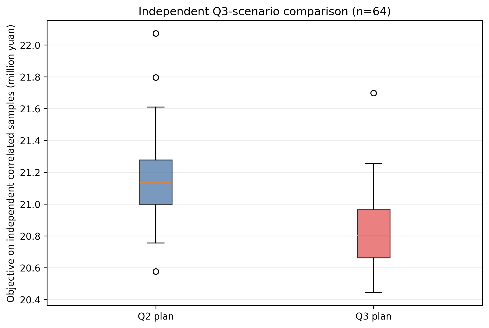

# 面向历史轮作与市场不确定性的多期农作物种植策略

## 摘要

针对 2024-C，本文建立了检查器优先的混合整数线性规划。模型把 2023 种植记录纳入 2024 历史边界，对智慧大棚按连续季次、其他地块按同季跨年检查重茬，并对每个地块检查六个滚动三年豆类窗口。销售上限按作物编号和季次跨全部地块类型汇总。四个冻结场景由完整精度面积变量独立复算，目标误差均为 0、八类硬约束均为 0 违约；冻结外部 Validator 亦返回 `valid=true`。Q2/Q3 的随机实验与冻结场景分离保存。独立相关样本显示 Q3 在本参数设定下不优于 Q2，因此本文仅报告经验证的可行策略，不宣称全局最优或相关性带来普遍改善。

**关键词：** 多期种植；混合整数线性规划；历史边界；滚动豆类；可复现验证

## 1 模型与口径

令 `x_{p,c,t,s}` 为地块、作物、年份和季次的连续种植面积，`z` 为作物活动变量，`m` 为水浇地模式。对作物--季次组，正常销售量 `q` 满足 `q<=R` 与 `q<=D`，其中 `R` 汇总所有地块类型的产量；Q1 半价情景的超额收入为 50%，其余冻结场景超额滞销。目标为销售收入减种植成本，`0.01 sum(z)` 只作同收益解的二级排序。

硬约束包括容量、适种性、水浇地模式、重茬、2023→2024 边界、每地块滚动三年豆类面积覆盖、非负/二元性和销售上限。完整数学表达、代码实现和独立检查函数见 `model_definition.md`；A1--A8 口径见 `assumptions.md`。

冻结 Q2/Q3 使用公开代表参数：`k=t-2023`，小麦/玉米需求乘 `1.075^k`，全部产量乘 `0.95`，成本乘 `1.05^k`，蔬菜、羊肚菌和其他食用菌价格分别乘 `1.05^k`、`0.95^k`、`0.97^k`。随机 Q2/Q3 不替代该冻结目标。

## 2 验证流程

先实现独立复算器和硬约束检查器，再求解。故障注入覆盖超面积、负面积、露地重茬、普通大棚同季跨年重茬、2023→2024 边界、豆类空窗和目标篡改，7/7 通过。每次求解后保存原始双精度变量，重新读取后复算目标和全部硬约束；随后将同一变量映射为 `formal_result.json`，交由冻结外部 Validator 复核。

## 3 冻结结果

表 1 的全部数字来自 `results/objective_validation.json`、`results/constraint_validation.json` 和 `results/frozen_external_validator_report.json`。

| 场景 | 独立复算目标（元） | 误差 | 内部硬约束违约 | 外部黑盒复核 |
| --- | ---: | ---: | ---: | --- |
| Q1：滞销 | 31,744,309.08 | 0 | 0 | 通过 |
| Q1：半价 | 42,411,529.79 | 0 | 0 | 通过 |
| Q2：冻结代表参数 | 28,116,634.04 | 0 | 0 | 通过 |
| Q3：冻结代表参数 | 28,116,634.04 | 0 | 0 | 通过 |

## 4 随机补充实验

Q2 与 Q3 分别用 `PCG64(2024071402)`、`PCG64(2024071403)` 生成 128 个训练样本；生成器、参数、原始解和样本 SHA-256 已保存。Q3 以价格--成本正相关 `+0.40`、自身价格--需求 `-0.30`、替代项 `+0.12`、互补项 `+0.08` 构造透明的参数化情景。

在独立 `PCG64(2024071499)` 的 64 个相关样本中，Q2 的平均目标为 21,156,589.23 元、CVaR10 为 20,816,448.77 元；Q3 分别为 20,815,683.22 元和 20,514,838.28 元。Q3 相对 Q2 的均值差为 -340,906.01 元、CVaR10 差为 -301,610.49 元。因此该相关设定没有带来风险改善。

## 5 结论与局限

本研究得到的是经内部独立复算和冻结外部黑盒复核的可行策略链条，而不是最优性证明。四次 HiGHS 求解均在 30 秒时间上限内返回可行解；不得称为全局最优。三年豆类仍是面积覆盖代理，缺少子地块数据时不能证明逐块土壤轮作。Q3 的相关性参数也只是可复现的情景假设，不是市场因果证据。

## 证据映射

| 结论 | 证据 |
| --- | --- |
| 冻结目标、目标误差 | `results/objective_validation.json` |
| 八类硬约束 | `results/constraint_validation.json` |
| 冻结外部复核 | `results/frozen_external_validator_report.json` |
| 随机种子与 SHA-256 | `results/q2_stochastic/random_seed.json`、`results/q3_stochastic/random_seed.json`、`results/scenario_artifacts_sha256.json` |
| 独立 Q2/Q3 比较 | `results/q3_stochastic/q3_comparison.json` |
